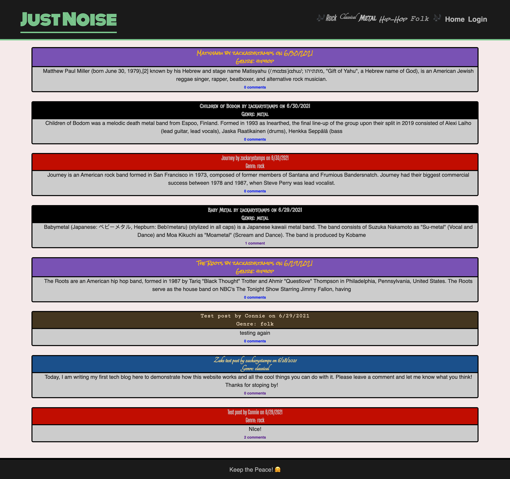

# music-placeholder
  Deployed Link: https://just-noise.herokuapp.com/
   
  Repo Link: https://github.com/d-trecker/just-noise/tree/main
    
  

  # Description
A music blog site created for a community of users who love to share their latest music finds and leverage other fans’ finds to identify the latest and greatest music of today.

  
  # Table of Contents 
  * [Installation](#installation)
  * [Usage](#usage)
  * [License](#license)
  * [Contributing](#contributing)
  
  # Installation
  The following must be installed or linked in order to run the application properly: <em>npm install express sequelize mysql2</em>, <em>npm install dotenv</em>, <em>npm init -y</em> <em>bcrypt</em> from the command line to initialize a new Node.js package.
  
  # Usage
  ​  As a music blogger, I want to be able to quickly update my followers when I find new music.  
When I identify a new album, I can enter information and a brief summary about the music on the blog site.
After I submit a blog post, I can edit the post’s contents
I can view my posts and track comments from other users
As a music fan, I want to be able to keep up on the latest music via blogs.
When I enter the dashboard, I can see posts of different types of musics
If I select a genre, I can see all posts related to that genre
If I leave a comment, I can edit the comment at a later time.
 
  # License
  This project is licensed under the Unlicense license.
  
  # Contributing
  ​Contributors: Dylan Trecker, Zak Stamps, Justin Villena, Cody Callahan, Mike Ebener and Lots of help from our trusty 'ol friend Google.
 
  If you have any questions about the repo, please open an issue withing the repo issues tab.
    
  

